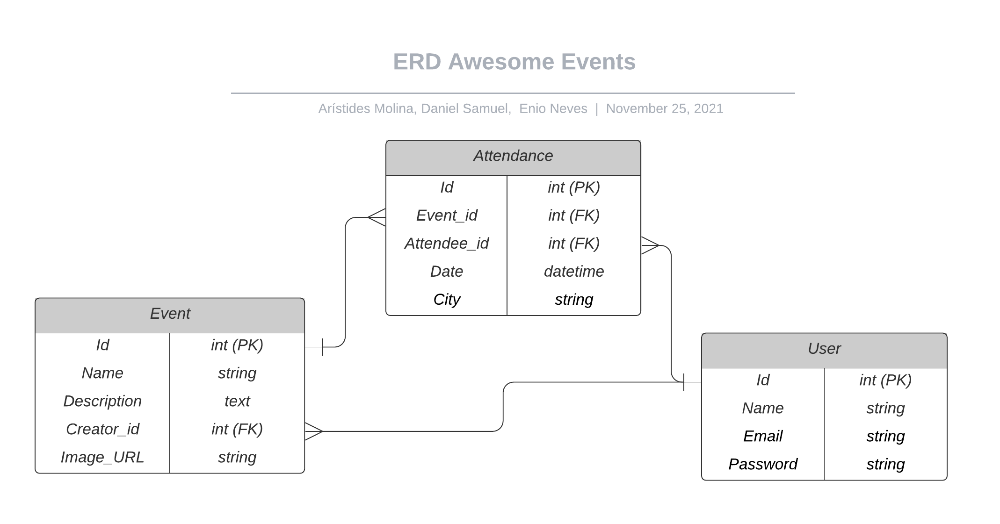
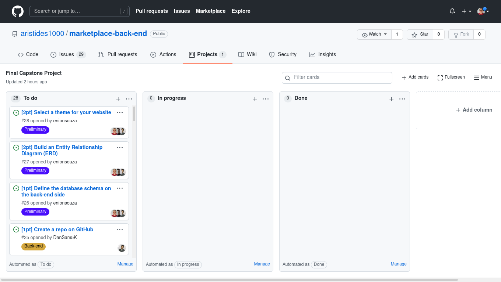
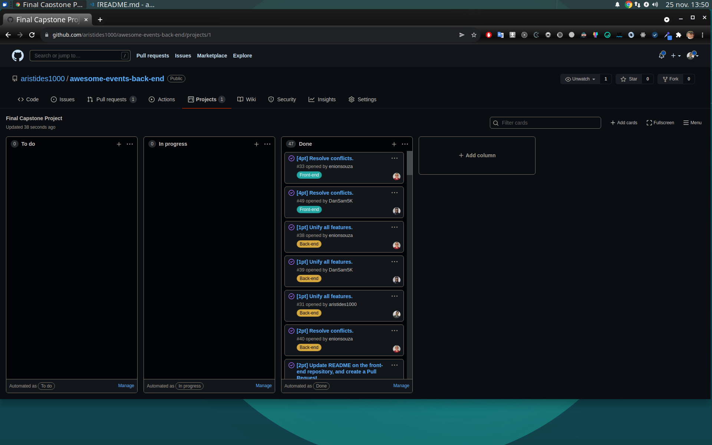

# Awesome Events (Back-End)!

## Live Version
- [Front-end live version](https://awesome-events.netlify.app)
- [Back-end API Live Version](https://awesome-events-back-end.herokuapp.com/)

## ERD
> 

## Kanban Board
[Kanban Board Url](https://github.com/aristides1000/awesome-events-back-end/projects/1)

### Kanban Board First Step
> 

### Kanban Board Final Step
> 

## About

The main goals for this exercise are:

- Implement a connection between a Ruby on Rails back-end and ReactJS front-end.
- Understand the pros and cons of different approaches of connecting Ruby on Rails back-end with ReactJS front-end.

In this project, only the Ruby on Rails back-end part was implemented. The front-end part of the project can be found in [this repo](https://github.com/enionsouza/awesome-events-front-end/).

## Built With

- Ruby on Rails
- RSpec
- PostgreSQL
- JWT
- Cloudinary
- VisualStudio Code, Git, & GitHub

## Pre-requisites

- Ruby (v. 3.0.1)
- Rails (v. 6.1.4)
- NodeJs (v. 14.17)
- YarnJs (v. 1.22.10)
- PostgreSQL (v. 12.8)
- Git

## Getting Started

1. In your terminal, in the folder of your preference, type the following bash command to clone this repository:

```sh
git clone git@github.com:aristides1000/awesome-events-back-end.git
```

2. Now that you have already cloned the repo run the following commands to get the project up and running:

```sh
cd awesome-events-back-end
bundle
rails db:create
rails db:migrate
```

3. Now, on your terminal, run:

```sh
rails server
```

This should start your local server in [http://localhost:3000/](http://localhost:3000/). Now, you can open the REST API client of your choice (Thunder Client extension for VScode is recommended) to fetch the data from the API.

## Live API endpoint
[https://awesome-events-back-end.herokuapp.com/](https://awesome-events-back-end.herokuapp.com/)

## API Endpoints
|                            Description                           |            Endpoint            | Method |                                                  Header                                                 | Body                                                                                                              |
|:----------------------------------------------------------------:|:------------------------------:|:------:|:-------------------------------------------------------------------------------------------------------:|-------------------------------------------------------------------------------------------------------------------|
|                              Sign Up                             |            `/users`            |  POST  | { "Accept": "application/json", "Content-Type": "application/json" }                                    | {"user": {"name": "Daniel", "email": "daniel@mail.com", "password": "123456", "password_confirmation": "123456"}} |
|                              Sign In                             |        `/users/sign_in`        |  POST  | { "Accept": "application/json", "Content-Type": "application/json" }                                    | {"user": {"email": "daniel@mail.com", "password": "123456"}}                                                      |
|                             Sign Out                             |        `/users/sign_out`       | DELETE | { "Accept": "application/json", "Content-Type": "application/json", "Authorization": "Bearer <TOKEN>" } |                                                                                                                   |
|                 Fetch User Properties from Token                 |         `/logged_user`         |   GET  | { "Accept": "application/json", "Content-Type": "application/json", "Authorization": "Bearer <TOKEN>" } |                                                                                                                   |
|                    Fetch all available events                    |            `/events`           |   GET  | { "Accept": "application/json", "Content-Type": "application/json", "Authorization": "Bearer <TOKEN>" } |                                                                                                                   |
|                        Create a new Event                        |            `/events`           |  POST  | { "Accept": "application/json", "Authorization": "Bearer <TOKEN>" }                                     | FormData(name: 'Event Title', description: 'Event Description', image: <Image File>))                             |
| Delete an Event (Only the Event Creator can perform this action) |       `/events/:event_id`      | DELETE | { "Accept": "application/json", "Content-Type": "application/json", "Authorization": "Bearer <TOKEN>" } |                                                                                                                   |
|                         Reserve an Event                         |         `/attendances`         |  POST  | { "Accept": "application/json", "Content-Type": "application/json", "Authorization": "Bearer <TOKEN>" } | { "attendance": { "event_id": 1, "date": "2025-01-01", "city": "Caracas" } }                                      |
|                   Fetch all user's Reservations                  |         `/attendances`         |   GET  | { "Accept": "application/json", "Content-Type": "application/json", "Authorization": "Bearer <TOKEN>" } |                                                                                                                   |
| Cancel a Reservation (Only the Attendee can perform this action) | `/attendances/:reservation_id` | DELETE | { "Accept": "application/json", "Content-Type": "application/json", "Authorization": "Bearer <TOKEN>" } |                                                                                                                   |

To stop the server, hit `<CTRL> + C` on your keyboard.

You can also find an API-consumer built with ReactJS in [this repo](https://github.com/enionsouza/awesome-events-front-end/) that will display one random greeting message in your browser.

## Author 👤 

👨‍💻 **Daniel Samuel**

- Github: [DanSam5k](https://github.com/DanSam5k)
- Twitter: [@_dan_sam](https://twitter.com/_dan_sam)
- Linkedin: [dansamuel](https://www.linkedin.com/in/dansamuel/)


👨‍💻 **Arístides José Molina Pérez**

- GitHub: [@aristides1000](https://github.com/aristides1000)
- Twitter: [@aristides_1000](https://twitter.com/@aristides_1000)
- LinkedIn: [aristides jose molina perez](https://www.linkedin.com/in/aristides-molina/)


👨‍💻 **Ênio Neves de Souza**

- GitHub: [@enionsouza](https://github.com/enionsouza)
- Twitter: [@enionsouza](https://twitter.com/enionsouza)
- LinkedIn: [Enio Neves de Souza](https://www.linkedin.com/in/enio-neves-de-souza/)

## 🤝 Contributing

Contributions, issues, and feature requests are welcome!

Feel free to check the [issues page](https://github.com/aristides1000/awesome-events-back-end/issues).

## Show your support

Give a ⭐️ if you like this project!
## Acknowledgments
- Hat tip to anyone whose code was used 🔰
- Inspiration 💘
- Microverse program ⚡
- Our standup team 🏹
- Our family's support 🙌

## 📝 License

This project is [MIT](https://opensource.org/licenses/MIT) licensed.